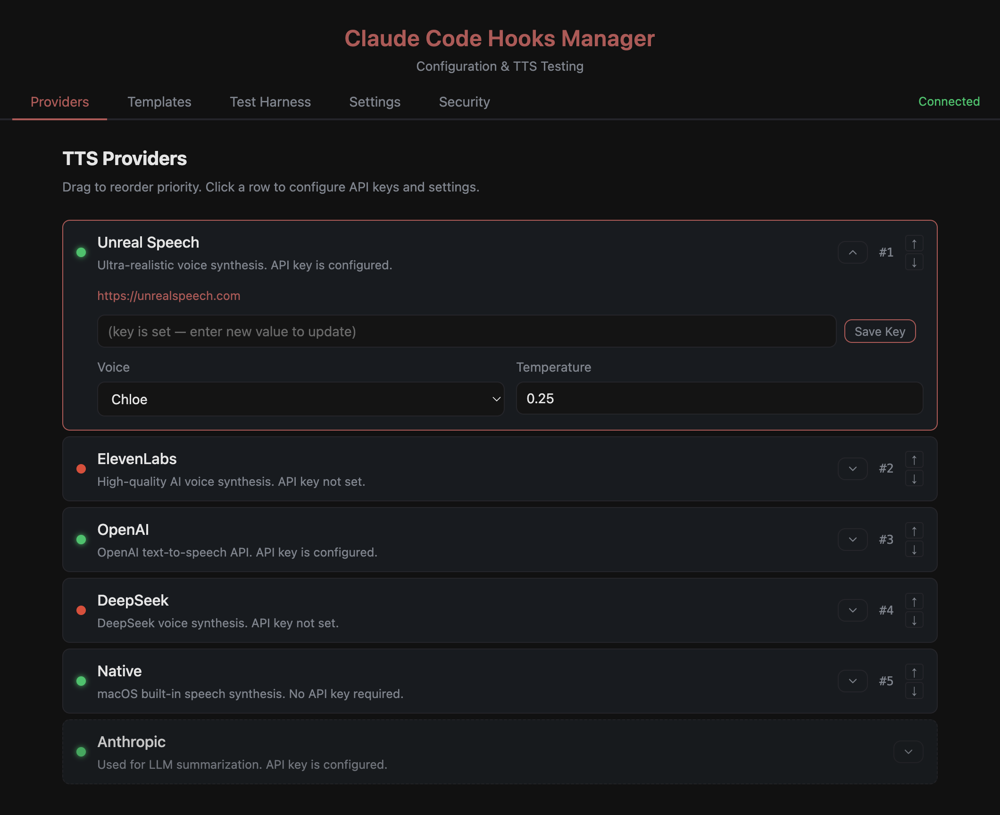
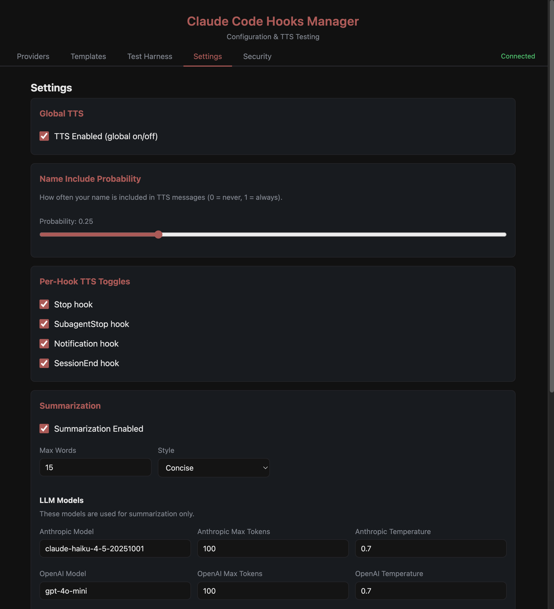

# claude-code-hooks

A comprehensive hooks system for [Claude Code](https://docs.anthropic.com/en/docs/claude-code) that adds security guardrails, TTS voice notifications, LLM-powered summaries, observability events, and more.

## Features

- **Security guardrails** — blocks dangerous `rm -rf` commands, protects `.env` files, detects excessive sleep/subagent loops
- **TTS voice notifications** — speaks completion summaries via ElevenLabs, Unreal Speech, OpenAI, macOS native, or DeepSeek
- **LLM-powered summaries** — generates concise activity summaries using Anthropic or OpenAI
- **Observability events** — sends structured hook events to a configurable server
- **Transcript parsing** — extracts recent activity from Claude Code's conversation transcript
- **Template system** — customizable message templates with variable rendering
- **Claude Code Hooks Manager app** — browser-based UI for testing and managing TTS providers (localhost:3455)
- **Fully configurable** — all behavior controlled via `hooks.config.json` with sensible defaults



## Prerequisites

- [Bun](https://bun.sh) (v1.0+)
- [Claude Code](https://docs.anthropic.com/en/docs/claude-code) CLI
- Optional: [jq](https://jqlang.github.io/jq/) (for smart settings merge during install)

## Installation

### Quick start (git clone)

```bash
cd your-project
git clone https://github.com/jboothe/claude-code-hooks-ui.git .claude/hooks
cd .claude/hooks && ./install.sh
```

### From a local copy

```bash
./install.sh local:/path/to/claude-code-hooks
```

### Custom server port

By default the Hooks Manager runs on port 3455. To use a different port, pass `--port` during install:

```bash
./install.sh /path/to/project local:/path/to/hooks --port 4000
```

This writes the port into `hooks.config.json` so the server starts on the right port from the first run. You can also change it later in the Settings UI or by setting the `PORT` environment variable.

### Update existing installation

```bash
./install.sh update
```

### Manual install

1. Clone or copy into `.claude/hooks/`
2. Run `bun install` in the hooks directory
3. Copy the `hooks` key from `settings.template.json` into your `.claude/settings.local.json`
4. Start a new Claude Code session

## Configuration

### hooks.config.json

All hook behavior is configurable via `hooks.config.json` in the hooks directory. If the file doesn't exist, sensible defaults from `lib/config.ts` are used.

```jsonc
{
  "tts": {
    "enabled": true,
    "providerPriority": ["native", "elevenlabs", "openai", "unreal-speech"],
    "hookToggles": {
      "stop": true,
      "subagentStop": true,
      "notification": true,
      "sessionEnd": true
    }
  },
  "llm": {
    "anthropic": { "model": "claude-haiku-4-5-20251001", "maxTokens": 100 },
    "openai": { "model": "gpt-4o-mini", "maxTokens": 100 }
  },
  "summarization": { "maxWords": 15, "style": "concise" },
  "security": {
    "dangerousPatterns": ["\\brm\\s+.*-[a-z]*r[a-z]*f"],
    "protectedPaths": ["/", "~", "$HOME"],
    "allowedPaths": ["trees/"]
  },
  "guardrails": {
    "enabled": true,
    "sleep": { "enabled": true, "maxSeconds": 120 },
    "subagentRepeat": { "enabled": true, "maxLaunches": 3 }
  },
  "server": { "port": 3455 }
}
```

### API Keys

Add to your project's `.env` file or export in your shell:

| Key | Features | Get it at |
|-----|----------|-----------|
| `USER_NAME` | TTS personalization | Your name for personalized TTS messages (e.g. "Done, Sarah!") |
| `OPENAI_API_KEY` | LLM summarization + TTS | [platform.openai.com](https://platform.openai.com) |
| `ANTHROPIC_API_KEY` | LLM summarization | [console.anthropic.com](https://console.anthropic.com) |
| `ELEVENLABS_API_KEY` | TTS | [elevenlabs.io](https://elevenlabs.io) |
| `UNREAL_SPEECH_API_KEY` | TTS | [unrealspeech.com](https://unrealspeech.com) |

**No API keys are required.** Hooks gracefully degrade without them — security guardrails, logging, and all core features work with zero keys. TTS falls back to the macOS native `say` command if no cloud provider keys are set. For summarization, you only need **one** of `OPENAI_API_KEY` or `ANTHROPIC_API_KEY`, not both.

## Architecture

```
.claude/hooks/
├── pre_tool_use.ts        # Security: blocks dangerous commands
├── post_tool_use.ts       # Post-tool logging
├── notification.ts        # Desktop + TTS notifications
├── stop.ts                # Completion: chat export, LLM summary, TTS
├── subagent_stop.ts       # Subagent completion notifications
├── pre_compact.ts         # Pre-compaction transcript processing
├── user_prompt_submit.ts  # Prompt logging, agent naming
├── session_start.ts       # Session init, context injection
├── session_end.ts         # Session cleanup
├── send_event.ts          # Observability event dispatch
├── hooks.config.json      # User-editable configuration
├── lib/
│   ├── config.ts          # Config loader with defaults
│   ├── constants.ts       # Shared constants and paths
│   ├── env.ts             # Environment helpers
│   ├── guardrails.ts      # Sleep/subagent loop detection
│   ├── hitl.ts            # Human-in-the-loop utilities
│   ├── log.ts             # JSON + debug logging
│   ├── model-extractor.ts # Extract model info from transcripts
│   ├── stdin.ts           # Stdin JSON parsing + CLI flag parsing
│   ├── summarizer.ts      # LLM-powered event summarization
│   ├── transcript-parser.ts # Conversation transcript parser
│   ├── types.ts           # Shared TypeScript types
│   ├── llm/               # LLM providers (anthropic, openai)
│   ├── tts/               # TTS providers (native, elevenlabs, openai, unreal-speech, deepseek)
│   ├── templates/         # Message template system
│   └── queue/             # File-lock FIFO queue for TTS
├── tts-app/
│   ├── server.ts          # Bun HTTP server (port 3455)
│   └── public/            # Browser UI (vanilla HTML/JS/CSS)
├── settings.template.json # Hook registrations for settings.local.json
├── install.sh             # One-command installer
└── package.json           # Dependencies: @anthropic-ai/sdk, openai, dotenv
```

## How hooks work

Claude Code fires hooks at specific lifecycle events. Each hook receives a JSON payload via stdin describing the event context.

| Event | When | What this system does |
|-------|------|----------------------|
| **PreToolUse** | Before any tool call | Blocks dangerous `rm` commands, protects `.env`, detects sleep/subagent loops |
| **PostToolUse** | After any tool call | Logs tool usage |
| **Notification** | When Claude sends a notification | Desktop notification + TTS announcement |
| **Stop** | When Claude finishes a response | Parses transcript, generates LLM summary, speaks via TTS, exports chat |
| **SubagentStop** | When a subagent finishes | TTS notification of subagent completion |
| **PreCompact** | Before context compaction | Preserves transcript data before compaction |
| **UserPromptSubmit** | When user submits a prompt | Logs prompt, stores for context, names the agent |
| **SessionStart** | When a session begins | Injects context, announces session |
| **SessionEnd** | When a session ends | Cleanup and final logging |

Each event also fires `send_event.ts` to dispatch an observability event to a configurable server (default: `localhost:4000/events`).

### Exit codes

- **0** — Hook succeeded (or failed gracefully)
- **2** — Block the tool call (PreToolUse only)

Hooks are designed to **never crash** — all top-level errors are caught and exit with code 0 to avoid disrupting Claude Code.



## Claude Code Hooks Manager

A browser-based app for testing TTS providers and managing the queue:

```bash
cd .claude/hooks
bun run tts-app
# Open http://localhost:3455 (or your configured port)
```

The port can be configured three ways (highest priority first):
1. `PORT` environment variable: `PORT=4000 bun run tts-app`
2. `server.port` in `hooks.config.json`
3. Default: `3455`

## Inspirational thanks to:
 [IndyDevDan](https://www.youtube.com/@indydevdan) 

## License

MIT
